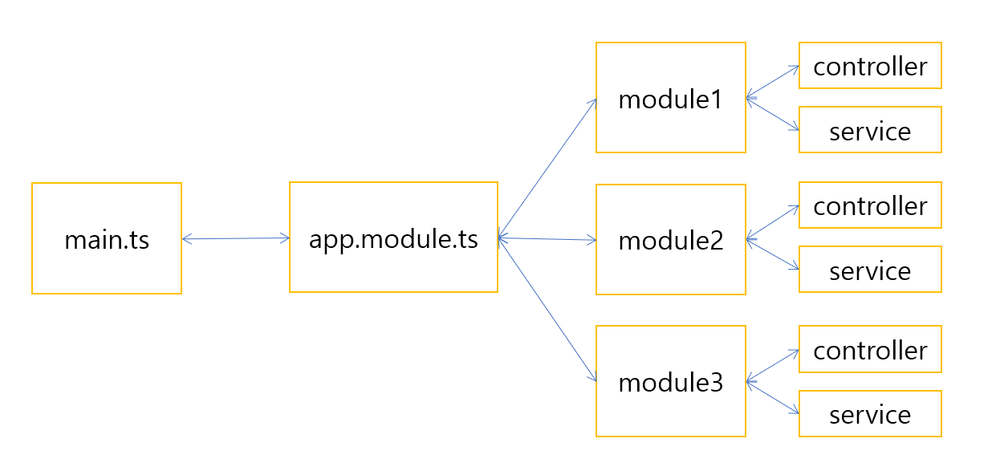
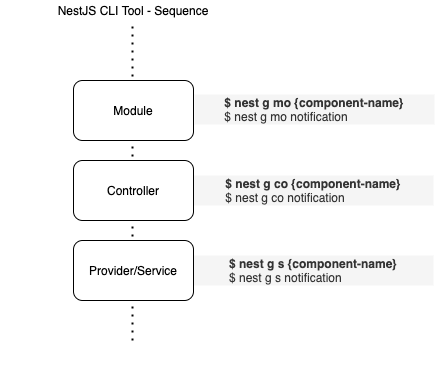

# Hi Nest!

Learning how to build Enterprise NodeJS applications using NestJS

- 노마드코더 강의 : [NestJS로 API 만들기](https://nomadcoders.co/nestjs-fundamentals)

- NestJS Document : https://docs.nestjs.com/

## 0. Project Setup

- @nestjs/cli 설치

  ```zsh
  npm install -g @nestjs/cli
  ```

- project 생성

  ```zsh
  nest new hi-nest    # project name: hi-nest
  ```

- run

  ```zsh
  npm run start:dev
  ```

- http://localhost:3000

## 1. Architecture of NestJS

- NestJS는 아키텍처의 정의를 프레임워크에서 제공하기 때문에 개발자들의 아키텍처가 통일되고 서로가 작성한 코드의 구조를 쉽게 파악할 수 있음
- 파일 구조 : main.ts -> app.module.ts (AppModule) -> app.controller.ts -> app.service.ts
- NestJS는 main.ts 파일을 가지며, 무조건 이 이름이여야만 한다. AppModule로 app을 생성함
- AppModule : 우리가 하는 모든 것을 Import한다. 모든 Module의 대장 (main.ts에서 app을 구성하는데 사용되고, listen으로 실행됨)
  - Module : 모듈은 비슷한 기능을 하는 코드들의 모음이다. service와 controller를 한 모듈로 묶어 하나의 덩어리를 형성. django로 치면 일종의 '앱'. photo 앱, user 앱 등
- 컨트롤러 : 기본적으로 URL을 가져오고 함수를 실행시킴. node.js에서 express의 라우터와 비슷한 존재. 즉 URL을 가져와 함수를 매핑함
- 서비스 : 컨트롤러는 URL을 가져오는 역할 뿐 비지니스 로직은 모두 서비스에 구현함. 서비스는 일반적으로 실제의 function을 가지는 부분
- 데코레이터 : 클래스에 함수 기능을 추가 할 수 있음. 데코레이터는 꾸며주는 함수나 클래스와 반드시 붙어있어야 함
- NestJS는 TypeScript를 지원함. TypeScript는 정적 타입을 통해 컴파일 타임에 타입 검사를 해서 코드의 안정성을 향상시킴



## 2. REST API

- NestJs CLI Tool - Sequence

  

- `movies` controller 생성

  - Nest CLI Tool에서 자동 생성된 `src/app.controller.ts`와 `src/app.service.ts` 파일을 삭제

  - `src/app.module.ts` 파일에서 `app.controller`, `app.service`와 관련 내용을 모두 삭제

  - 아래 명령을 실행하면, `src/movies` 폴더에 `movies.controller.ts`가 생성되고, `app.module.ts` 파일에 `MoviesController` 모듈이 `controllers`에 등록됨

  ```zsh
  nest g co    # nest generate controller ==> movies
  ```

- `movies` service 생성

  - 아래 명령을 실행하면, `src/movies` 폴더에 `movies.service.ts`가 생성되고, `app.module.ts` 파일에 `MoviesService` 모듈이 `providers`에 등록됨

  ```zsh
  nest g s    # nest generate service ==> movies
  ```

- DTOs and Validation

  - DTO : Data Transfer Object is model definitions for transferring Object between Layers

    - CreateMovieDto example

    ```js
    export class CreateMovieDto {
      @IsString()
      readonly title: string;

      @IsNumber()
      readonly year: number;

      @IsOptional()
      @IsString({ each: true })
      readonly geners: string[];
    }
    ```

  - ValidationPipe

    ```js
    async function bootstrap() {
      const app = await NestFactory.create(AppModule);
      app.useGlobalPipes(
        new ValidationPipe({
          whitelist: true, // validator will strip validated object of any properties that do not have any decorators
          forbidNonWhitelisted: true, // instead of stripping non-whitelisted properties validator will throw an error
          transform: true, // arguments type transform (ex, string ==> number)
        }),
      );
      await app.listen(3000);
    }
    ```

- movies Module and app Controller 생성

  - `app.module.ts` controllers와 providers에 등록된 `MoviesController`와 `MoviesService`를 지우고, 아래 명령으로 `movies` 모듈을 생성

  ```zsh
  nest g mo    # nest generate module ==> name: movies
  ```

  - `movies.module.ts`에 아래와 같이 controllers와 providers 추가

  ```js
  @Module({
    controllers: [MoviesController],
    providers: [MoviesService],
  })
  export class MoviesModule {}
  ```

  - `/`로 접속 시 Home page를 생성하기 위해 아래와 같이 `app` controller 생성 후 `app.controllers.ts`를 `src` 폴더로 이동하고 불필요한 파일은 삭제

  ```zsh
  nest g co    # nest generate controller ==> name: app
  ```

  - `app.controllers.ts`에 아래와 같이 Home Page API 작성

  ```js
  @Controller('')
  export class AppController {
    @Get()
    home() {
      return 'Welcome to my Movie API';
    }
  }
  ```

  - `http://localhost:3000` 호출 시 `home()`이 실행되고, `http://localhost:3000/movies` 호출 시 `movies.controller.ts`의 `getAll()`이 호출됨

    - GET `http://localhost:3000` ===> home()
    - GET `http://localhost:3000/movies` ===> getAll()
    - GET `http://localhost:3000/movies/1` ===> getOne()
    - GET `http://localhost:3000/movies/search?year=2022` ===> search()
    - POST `http://localhost:3000/movies` ===> create(with body)
    - DELETE `http://localhost:3000/movies/1` ===> remove()
    - PATCH `http://localhost:3000/movies/1` ===> patch(with body)

## Folder Example

```
├── dist    // Source build
├── node_modules    // node packages
├── src
│   ├── movies    // movies module
│   │   ├── dto
│   │   ├── entities
│   │   ├── movies.controller.ts    // Nest Controllers
│   │   └── movies.service.ts    // Nest Services
│   ├── app.module.ts    // AppModule and Moudles
│   └── main.ts    // Mandatory file name - starting point
├── test
│   ├── app.e2e-spec.ts
│   └── jest-e2e.json
├── .eslintrc.js
├── .gitignore
├── .prettierrc
├── nest-cli.json
├── package-lock.json
├── package.json
├── tsconfig.build.json
├── tsconfig.json
└── README.md
```
